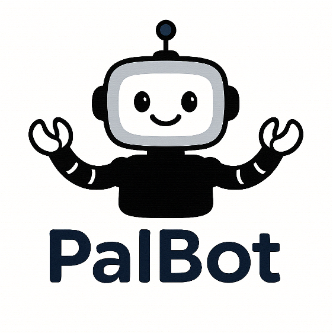
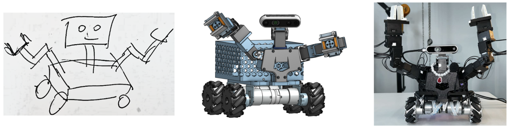

#  PalBot

# Technological Innovations:
This project has developed a dual-arm wheeled desktop robot, with both the mechanical structure and system integration independently designed.

1. **Low-Cost, High-Degree-of-Freedom Robot Design**

   - The robot's structure is entirely self-designed and manufactured via 3D printing, achieving extremely low production costs.
   - The robot features a dual-arm design, with each arm having 5 degrees of freedom (DoF) plus a gripper, and the head providing 2 DoF, totaling **14 DoF**.
   - Cost-effective motors are used for actuation, significantly reducing overall costs. The four-wheel drive employs a **Mecanum wheel** solution, with each motor costing around **$27**.

2. **Structural Optimization and Reachability Verification**
   - Through mechanical simulation and reachability analysis, the robot's dual arms are ensured to have a wide operational workspace, capable of desktop interaction and grasping tasks.

3. **Universal Intelligent Control Framework: Cradle**


   - The self-developed **modular intelligent control framework "Cradle"** serves as the robot's brain, supporting six functional modules:
     - Information gathering
     - Self-reflection
     - Task reasoning
     - Skill management
     - Action planning
     - Memory
   - It enables **proactive conversation guidance, long-term memory**, and enhances human-robot emotional interaction.

4. **Physical Interaction Skill Library**
   - Capable of **continuously learning new skills** and maintaining an expandable skill library.
   - A robust skill library is built, including:
     - Grasping pose estimation
     - Visual tracking
     - Kinematic solving
     - Motion planning
   - This ensures **general and reliable grasping and physical interaction** capabilities.

# Demo Video:

[Skill Library Showcase](./res/file/video/Skill%20Library.mp4)

[Pick up Snack Showcase](./res/file/video/Pick%20up%20Snack.mp4)

[Pick up Trash Showcase](./res/file/video/Pick%20up%20Trash.mp4)

[Delivery a Birthday Card Showcase](./res/file/video/Delivery%20a%20Birthday%20Card.mp4)

[Dialog Showcase](./res/file/video/Dialog.mp4)

[Eyesight Tracking Showcase](./res/file/video/Eyesight%20Tracking.png)

# 🚀 Get Started
## Installation of Environment

```bash
conda create -n palbot-dev python=3.10.16
conda activate palbot-dev

pip install --upgrade torch==2.1.1+cu118 -f https://download.pytorch.org/whl/torch_stable.html
pip install torchvision==0.16.1+cu118 -f https://download.pytorch.org/whl/torch_stable.html
pip install -r requirements.txt
```

## Run the Project

Download the project and run the following command to start the project:

```bash
python -m runner
```

# 🌲 Project Structure

```markdown
PalBot/
├── conf/
│   ├── env_config_palbot.json         # environment config file (palbot only)
│   └── openai_config.json             # OpenAI API key config file
├── hardware/
│   ├── audio_manager.py                 # AudioManager class for managing microphone and speaker
│   ├── camera.py                       # Camera class for realsense camera image capture
│   ├── microphone.py                   # Microphone class for recording audio
│   ├── multi_dynamixel_controller.py # MultiDynamixelController class for controlling multiple dynamixel motors
│   └── speaker.py                      # Speaker class for playing audio
├── pal_agent/
│   ├── config/
│   │   ├── config.py                   # Configuration class for loading and managing configurations
│   │   └── palbot_config.py            # Palbot configuration class for loading and managing palbot-specific configurations
│   ├── environment/
│   │   ├── palbot/
│   │   │   ├── atomic_skills/
│   │   │   │   └── interact.oy            # interact skill for palbot like move
│   │   │   ├── composite_skills/
│   │   │   └── skill_registry.py          # SkillRegistry class for Palbot
│   │   ├── skill_registry_factory.py      # SkillRegistryFactory class for creating skill registries
│   │   ├── skill_registry.py              # SkillRegistry class for managing skills
│   │   ├── skill.py                      # Skill class
│   │   └── utils.py                      # Utility functions for environment
│   ├── gameio/
│   │   └── game_manager.py               # GameManager class for managing state and actions
│   ├── log/
│   │   └── logger.py                     # Logger class for logging
│   ├── memory/
│   │   ├── base.py                       # Base class for memory
│   │   └── local_memory.py               # LocalMemory class for managing local memory
│   ├── module/
│   │   └── executor.py                   # Executor class for executing actions
│   ├── provider/
│   │   ├── audio/
│   │   │   ├── asr_provider.py           # ASRProvider class for speech recognition
│   │   │   └── tts_provider.py           # TTSProvider class for text-to-speech
│   │   ├── frame/
│   │   │   └── frame_provider.py          # FrameProvider class for managing frames
│   │   ├── llm/
│   │   │   ├── llm_factory.py            # LLMFactory class for creating LLM providers
│   │   │   └── openai_provider.py         # OpenAIProvider class for OpenAI API
│   │   ├── palbot/
│   │   │   ├── client.py                 # Client class for palbot
│   │   │   └── palbot_interface.py       # PalbotInterface class for palbot
│   │   ├── video/
│   │   │   ├── video_ocr_provider.py     # VideoOCRProvider class for video OCR
│   │   │   └── video_provider.py         # VideoProvider class for video
│   │   └── base_provider.py              # BaseProvider class for providers
│   ├── utils/
│   │   ├── audio_utils.py                # Audio utility functions
│   │   ├── check.py                      # Check utility functions
│   │   ├── dict_utils.py                 # Dictionary utility functions
│   │   ├── encoding_utils.py             # Encoding utility functions
│   │   ├── file_utils.py                 # File utility functions
│   │   ├── image_utils.py                # Image utility functions
│   │   ├── json_utils.py                 # JSON utility functions
│   │   ├── singleton.py                  # Singleton utility functions
│   │   └── string_utils.py               # String utility functions
│   └── constants.py                      # Constants for the project
├── res/
│   ├── file/                             # Resource files
│   ├── prompts/                          # Prompt files
│   └── skills/                           # Skill files
├── runs/                                 # Log files
├── .env                                  # Environment variables
├── .gitignore                            # Git ignore file
├── README.md                             # Project README
├── requirement.txt                       # Project requirements
└── runner.py                             # Main runner file
```

# Acknowledgements

This project is based on the following projects:

**Cradle:** [Website](https://baai-agents.github.io/Cradle/), [GitHub](https://github.com/BAAI-Agents/Cradle)

**QuadWBG:** [Website](https://quadwbg.github.io/), [GitHub](https://github.com/javokhirajabov/quadwbg)

**Being-0:** [Website](https://beingbeyond.github.io/being-0/), [GitHub](https://github.com/BeingBeyond/being-0)

# Citation
If you find our work useful, please consider citing us and star our repository!

```
@article{tan2024cradle,
  title={Cradle: Empowering Foundation Agents towards General Computer Control},
  author={Weihao Tan and Wentao Zhang and Xinrun Xu and Haochong Xia and Ziluo Ding and Boyu Li and Bohan Zhou and Junpeng Yue and Jiechuan Jiang and Yewen Li and Ruyi An and Molei Qin and Chuqiao Zong and Longtao Zheng and Yujie Wu and Xiaoqiang Chai and Yifei Bi and Tianbao Xie and Pengjie Gu and Xiyun Li and Ceyao Zhang and Long Tian and Chaojie Wang and Xinrun Wang and Börje F. Karlsson and Bo An and Shuicheng Yan and Zongqing Lu},
  journal={arXiv preprint arXiv:2403.03186},
  year={2024}
}

@article{wang2024quadwbg,
  title={QuadWBG: Generalizable Quadrupedal Whole-Body Grasping},
  author={Wang, Jilong and Rajabov, Javokhirbek and Xu, Chaoyi and Zheng, Yiming and Wang, He},
  journal={arXiv preprint arXiv:2411.06782},
  year={2024}
}

@article{yuan2025being,
    title={Being-0: A Humanoid Robotic Agent with Vision-Language Models and Modular Skills},
    author={Yuan, Haoqi and Bai, Yu and Fu, Yuhui and Zhou, Bohan and Feng, Yicheng and Xu, Xinrun and Zhan, Yi and Karlsson, B{\"o}rje F and Lu, Zongqing},
    journal={arXiv preprint arXiv:2503.12533},
    year={2025}
}
```
